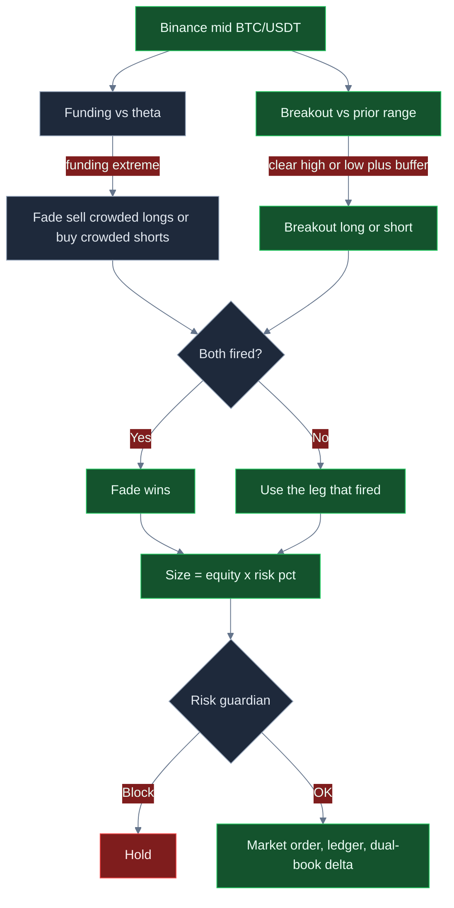

<p align="center">
  
</p>

# Binance Spot- & Futures-Trading-Bot

<p align="center">
  <strong>Handle auf Binance’ tiefsten Büchern: gepufferte Breakouts, Funding-Crowd-Fades, BNB-bewusste Kosten und harte Risikobremsen.</strong><br/>
  binance · BTC/USDT · Spot + Dual-Book · Live-CCXT · risk-gated · MIT
</p>

<p align="center">
  
  
  
  
  
</p>

<p align="center">
  Sprachen: [English](README.md) · [中文](README.zh.md) · **Deutsch** · [Español](README.es.md)
</p>

> **Suchbegriffe:** binance trading bot · binance futures bot · binance spot bot · BNB fee discount trading

Binance bündelt die globale BTC/USDT-Liquidität. Dieses System nimmt diese Tiefe ernst: Einstieg erst, wenn der Preis eine definierte Range verlässt; Fade, wenn Perp-Funding überfüllt ist; Größe als Anteil am Equity; Ablehnung, wenn Tagesverlust, Drawdown oder Clip-Caps bereits heiß sind. Defaults sind ein Start-Desk — **das attraktive ROI-/Win-Rate-/Drawdown-Profil kommt, wenn Sie Buffer, Funding-Schwelle, Size und R-Multiples auf Ihr Buch kalibrieren.**

Die englische Produktstimme steht in **[README.md](README.md)**. Charts und Tuning-Tabelle sind auf dieser Seite.

---

## Für wen

- Aktive Trader, die in **Entries, Exits, Fees und Risikoeinheiten** denken.
- Desks, die **Binance-Spot und USDT-M-Crowding in einer Loop** wollen: Breakout plus Funding-Fade.
- Operatoren mit **Live-Pfad** (CCXT-Market, `--confirm-live`, API-Keys) und **Kill-Switch plus Dollar-Bremsen** vor jeder Absicht.
- Tuner, die `settings.json` ändern — keine Garantie-Maschine.

---

## Strategie

Zwei Beine, ein Entscheidungspfad. **Funding-Fade gewinnt bei Gleichstand.**

**Breakout.** Rollendes Mid-Fenster (`breakoutLookback`, Default 20). Long nur, wenn der letzte Print das Prior-High um `breakoutBufferPct` übersteigt (Default `0.15` = **0,15%**). Short analog unter dem Low. Der Buffer ist der Fakeout-Filter.

**Funding-Fade.** Extrem positives Funding → Longs crowded → **verkaufen**. Extrem negativ → **kaufen**. Schwelle `fundingFadeThreshold` (Default `0.0008`). Der Fade **überschreibt** den Breakout, wenn beide feuern.

**Size.** \(N = E \times \texttt{riskPerTradePct}/100\) (Default **0,5%** Equity). Auf $10k ≈ $50 Starter-Clip. Mehr Punch: `riskPerTradePct` **zusammen** mit `maxPositionUsd` / `maxNotionalUsd` anheben.

**Dual-Book.** Nach dem Fill: Spot-Qty plus ~98% gegenläufige Perp-Notion, damit **Net-Delta sichtbar** bleibt. Keine zweite stille Live-Order.

**BNB.** `useBnbDiscount: true` setzt effektive Taker-bps auf ~**75%**. Nur korrekt, wenn das Konto wirklich mit BNB zahlt.

**Risk-Gate.** Tagesverlust, Peak-Drawdown, Notional, Position, Kill-Switch — alles muss klar sein.

---

## Warum die Kante stark sein kann

Auf dünnen Venues frisst Slippage 0,15%. Auf BTC/USDT kann derselbe Buffer ein echter Range-Break sein, während Taker-Kosten wenige bps bleiben.

Reine Breakouts werden in Ranges gehäckselt. Reine Fades werden in Einweg-Trends überrannt. **Zusammen** kann der Fade einen Breakout in crowded Perps stoppen, und der Breakout kann Range-Expansion nutzen, wenn Funding ruhig ist.

Dieselben Knöpfe zerstören ein Buch, wenn der Buffer in News gedreht und Size gegen den Trend erhöht wird. Keine Gewinn-Garantie.

---

## Regime

| Regime | Tape | Desk |
|---|---|---|
| Zweiseitige Majors, liquide Stunden | Echte Books, Ranges die brechen | Breakout kann zahlen |
| Funding-Extrem, noch zweiseitig | Stretch, dann Mean-Reversion | Fade oft die bessere Trade |
| Enge Range | Mikro-Wiggles | Holds; zu enger Buffer = Churn |
| Einweg-Trend / Squeeze | Funding bleibt hoch, Preis läuft | Fades bluten; DD-Bremse |
| News-Gap / Outage | Diskontinuierliche Prints | Kill-Switch und Caps |

---

## Mathematik

$$
\text{long} \iff C_t > H_t(1+b),\quad b=\texttt{breakoutBufferPct}/100
$$

$$
\text{sell} \iff f_t \ge \theta,\qquad \text{buy} \iff f_t \le -\theta
$$

$$
N = E \times \frac{\texttt{riskPerTradePct}}{100}
$$

Break-even-Winrate vor Fees bei 2R/1R = **33%**. Fees heben die Schwelle — deshalb BNB und Buffer.

$$
EV_{\text{net}} = pW - (1-p)L - N(f_{\text{eff}}+s)
$$

$$
f_{\text{eff}} = f_{\text{taker}}\times(0{,}75\text{ falls BNB})
$$

---

## Statistik

Abhängig von Settings, Regime und Tuning. **Kein garantierter Gewinn.** Szenarien aus der Strategiemathematik, $10.000-Buch.

### Optimiertes Szenario (illustrativ)

Lookback `24`, Buffer `0.18`, θ `0.0010`, Risk `0.45%`, Clip nahe **$1.900**, TP/SL `2.2`/`1`, BNB an.

| Metrik | Wert |
|---|---:|
| Sample | **96 Trades** |
| Winrate | **54,4%** |
| Loss-Rate | **45,6%** |
| Avg Win / Loss | **$41,20 / $20,40** |
| Payoff | **2,02** |
| Erwartungswert / Trade | **+$12,12** |
| Netto-PnL / ROI | **+$1.164 / +11,6%** |
| Profit Factor | **2,41** |
| Max Drawdown | **4,6%** |
| Return/Risk | **~1,9** |
| Best / Worst | **+$88 / −$34** |
| Win-/Loss-Streak | **8 / 4** |
| Mix | **~58% Breakout / 42% Fade** |

### Default-ähnlich (illustrativ)

Winrate 51,2% · Payoff 1,18 · EV ~+$3,40 · ROI ~+2,0% · PF 1,21 · Max-DD 7,4%. Defaults sind die Rampe, nicht die Decke. Der Sprung im Profit Factor kommt von **Buffer + θ + Clip-Size**.

---

## Charts

**Grün = Gewinn / Win. Rot = Verlust / schwächerer Pfad.** Der Entscheidungspfad ist GitHub-Mermaid. Die Performance-Charts sind 3D-Style-PNGs, damit sie auf GitHub sichtbar sind.

### Entscheidungslogik



### Win / Loss Mix

<p align="center">
  
</p>

Die Pies sehen ähnlich aus. **Der Payoff macht den Unterschied.** Tuned hält ~2R-Gewinner (grün); default-ähnlich lässt Gebühren das R flachdrücken (größeres rotes Segment).

### Erwartungswert vs Breakout-Buffer

<p align="center">
  
</p>

Zu eng (`0.08`, rot) overtradet Binance-Rauschen. Geliefert `0.15` ist nutzbar. **`0.18` ist der illustrative grüne Peak**, bevor Fills verhungern.

### Equity-Pfad

<p align="center">
  
</p>

Grüne Linie: getuntes Szenario. Rote Linie: default-ähnlicher Drift. Gleiche Venue, gleiche Beine — **andere Knöpfe**.

### Drawdown

<p align="center">
  
</p>

Rote Fläche ist der Underwater-Pfad. Die gestrichelte grüne Linie ist der 8%-Halt. Der getunte Pfad blieb in diesem Szenario bei ~4,6%. Size verdreifachen ohne weiteren Buffer — dann trifft die Hülle den Halt.

---

## Parameter-Tuning — ROI, Winrate und Verlustkontrolle

Behandeln Sie `settings.json` als **Desk**, nicht als Trophäen-Screen.

| Ziel | Knopf | Richtung | Fehlermodus |
|---|---|---|---|
| Weniger Fakeouts, besserer Payoff | `breakoutBufferPct` | **0.15 → 0.18–0.22** | Zu weit → fast keine Fills |
| Fade nur bei echtem Crowding | `fundingFadeThreshold` | **0.0008 → 0.0010–0.0012** | Zu hoch → Fade feuert nie |
| Mehr Punch pro Fill | `riskPerTradePct` **und** `maxPositionUsd` | **zusammen** anheben | Nur Size → Guardian blockt oder DD explodiert |
| Stärkere Payoff-Schiefe | `takeProfitR` / `stopLossR` | z. B. **2.2 / 1.0** | Riesiges TP, winzige WR → EV stirbt |
| Weniger Fee-Drag | `useBnbDiscount` | `true` **nur wenn BNB wirklich zahlt** | Flag an, kein BNB → Selbsttäuschung |
| Engeres Schmerzlimit | `maxDailyLossUsd`, `maxDrawdownPct` | Beim Lernen etwas **enger** | So eng, dass ein normaler Tag nicht durchkommt |

**Reihenfolge:** Size klein lassen → Buffer → θ → BNB/VIP prüfen → erst dann `riskPerTradePct` anheben, ohne `maxPositionUsd` zu brechen.

---

## Risiko

| Bremse | Default | Wirkung |
|---|---:|---|
| `maxDailyLossUsd` | **250** | Halt bei Tages-PnL ≤ −$250 |
| `maxDrawdownPct` | **8** | Halt bei 8% vom Peak |
| `maxNotionalUsd` | **5000** | Block über Cap |
| `maxPositionUsd` | **2500** | Block einzelner Clip |
| `killSwitch` | **false** | `true` friert alles |
| Live | `--confirm-live` | Kein versehentliches Live |
| Sandbox | `true` | An lassen, bis Keys sitzen |

Withdrawals auf API-Keys deaktivieren. `.env` nie committen. Swap + Hebel = Liquidationsrisiko.

---

## Quickstart

```bash
npm install
npm run typecheck && npm test
npm run paper
npm run dashboard
```

```bash
cp .env.example .env
# BINANCE_API_KEY + BINANCE_API_SECRET
npm run live -- --confirm-live
```

Node **20+**. Getuntes Beispiel: `breakoutLookback` 24, `breakoutBufferPct` 0.18, `fundingFadeThreshold` 0.001, `riskPerTradePct` 0.45, `takeProfitR` 2.2, `useBnbDiscount` true.

---

## Grenzen

Krypto kann Geld verlieren. **Keine Garantie.** Szenario-Zahlen sind illustrativ. Size im Engine ist **Equity-%**, nicht ATR. Dual-Book ist Inventar-Sichtbarkeit; Live sendet Market für `marketType` (geliefert: spot). BNB-Flag nur mit echtem BNB-Fee-Pay. Keine Fondsverwaltung, keine Anlageberatung.

---

## Klonen. Tunen. Bestes Setup finden.

```bash
npm install && npm test && npm run paper
```

**Lizenz:** MIT — [LICENSE](LICENSE).
