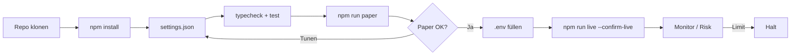
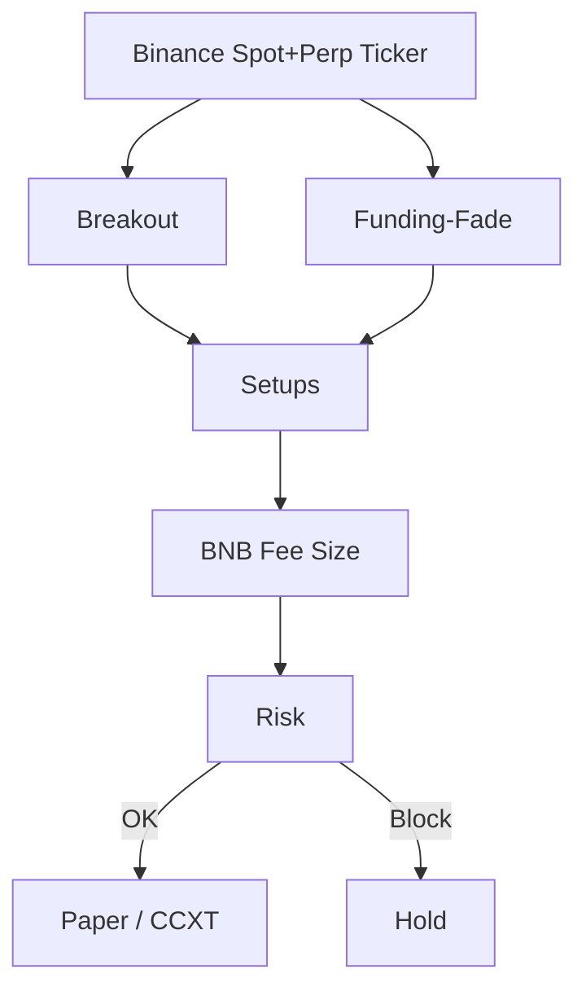

<p align="center">
  
</p>

# Binance Spot & Futures Trading Bot

<p align="center">
  <strong>Deepest books on earth — spot + USDT-M with BNB fee discipline</strong><br/>
  binance · paper + live · risk-gated · MIT
</p>

<p align="center">
  
  
  
  
</p>

<p align="center">
  Sprachen: [English](README.md) · [中文](README.zh.md) · **Deutsch** · [Español](README.es.md)
</p>

> **Suchbegriffe:** binance trading bot · binance futures bot · binance spot bot · BNB fee discount trading

---

## Performance-Snapshot

Demo-Analytics aus dem statischen Dashboard (`npm run dashboard`). Banner und Strategie-Diagramme bleiben erhalten.

<p align="center">
  
</p>

<p align="center">
  
</p>

<p align="center">
  
</p>

---

## Projekt-Workflow

Klonen → konfigurieren → Paper → Credentials → Live. Risk immer an.



| | |
|--|--|
| `npm run paper` | Zuerst Paper — keine API-Keys |
| `npm run dashboard` | Lokales Analytics-Dashboard öffnen (statisch) |
| `npm run live` | Benötigt `--confirm-live` + API-Credentials |

---

## Platform-Fit

| | |
|--|--|
| Venue | binance |
| Märkte | both |
| Edge | Deepest books on earth — spot + USDT-M with BNB fee discipline |
| Execution | CCXT Live (Sandbox) + Paper |

---

## Handelsstrategie

Binance bietet die tiefste globale Spot- und USDT-M-Liquidität. Der Bot nutzt diese Tiefe: **Breakout-Momentum** plus **Funding-Crowding-Fade**, mit **BNB-Fee-Awareness**, damit Kosten den Edge nicht auffressen. Spot-/Hedge-Buchhaltung macht Netto-Delta vor dem Risk-Gate sichtbar.

### So funktioniert es
- **Breakout** — Rolling Lookback; Entry nur mit Buffer außerhalb der Range.
- **Funding-Fade** — Extremes Funding als Crowding-Signal fadern.
- **Priorität** — Extreme Fades überschreiben Breakouts.
- **Sizing** — Festes Equity-% (`riskPerTradePct`); BNB-Discount senkt effektive Fees.
- **Dual Book** — Spot-Fills mit nahezu offsettendem Perp-Notional im internen Book.
- **Risk Gate** — Tagesverlust, Drawdown, Notional-/Positions-Caps, Kill-Switch.

### Wann der Edge erscheint
**Bestes Regime:** liquide Majors, zweiseitiger Flow, gelegentliche Funding-Extreme.

### Wann es scheitert
**Scheitert bei:** One-Way-Trends, persistentem Funding ohne Reversion, zu engem Buffer (Fee-Churn).

### Schlüsselparameter (`settings.json`)
- `breakoutLookback` / `breakoutBufferPct`
- `fundingFadeThreshold`
- `riskPerTradePct` / R-Multiples
- `useBnbDiscount`
- `risk.*`

### Strategiespezifische Risiken
- Perps bergen Liquidationsrisiko.
- Paper ≡ Live-Entscheidungspfad.
- Zuerst Sandbox / winzige Size.


---

## Strategie-Diagramm



---

## Architektur

```
src/
  config/     Zod settings + env loader
  strategy/   venue-specific engine
  broker/     paper + CCXT live adapters
  risk/       daily loss / drawdown / caps
  app/        runtime loop
  fees/
  books/
  signals/
```

---

## Schnellstart

```bash
cd binance-spot-futures-trading-bot
npm install
npm run typecheck
npm test
npm run paper
```

### Live

```bash
cp .env.example .env
# set BINANCE_API_KEY + BINANCE_API_SECRET
# optional BINANCE_PASSWORD / PASSPHRASE
npm run live
```

---

## Konfiguration

`settings.json` — strategy + risk + paper/live flags.  
`.env` — secrets only (see `.env.example`).

---

## Risiko & Sicherheit

- Live refuses without `--confirm-live` and API credentials
- Prefer `live.sandbox: true` until proven
- Disable withdrawals on exchange API keys
- Daily loss / drawdown / notional caps + kill switch

---

## Haftungsausschluss

MIT-Bildungssoftware — **keine Finanzberatung**. CEX-Trading kann Totalverlust bedeuten.

## Lizenz

MIT — siehe [LICENSE](LICENSE).
