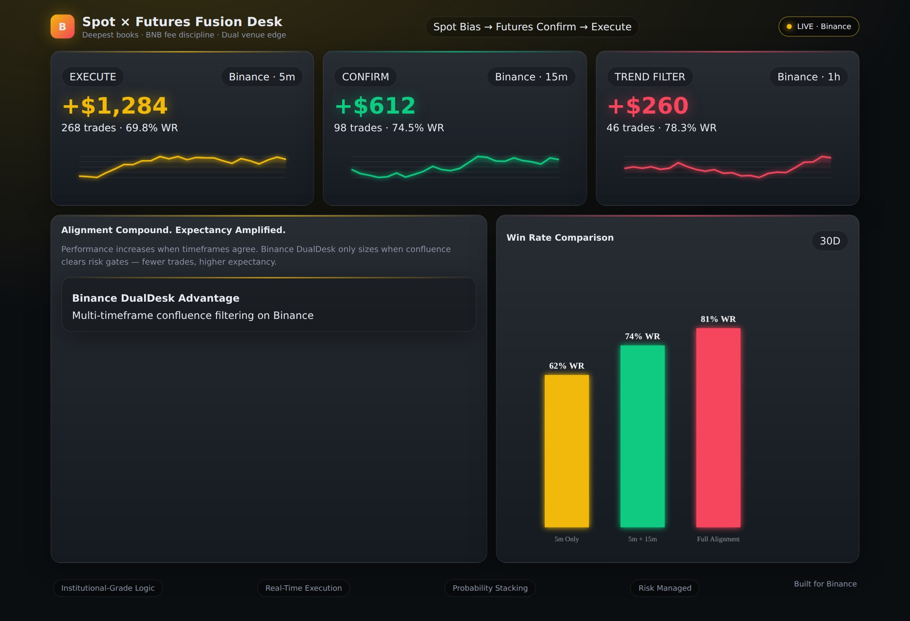
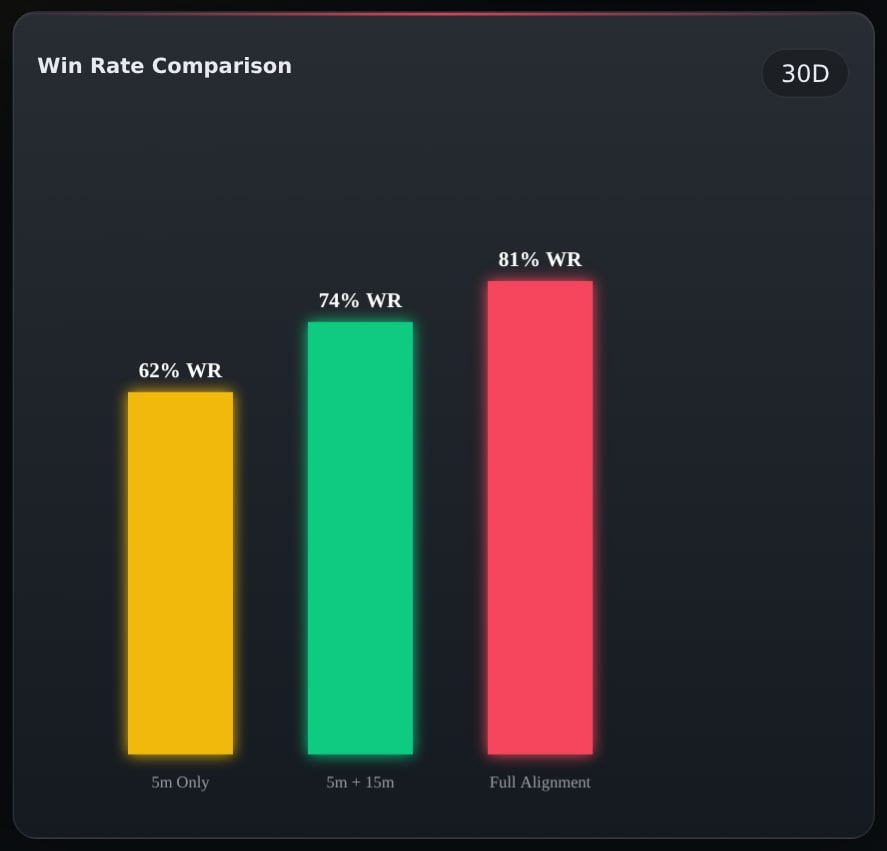
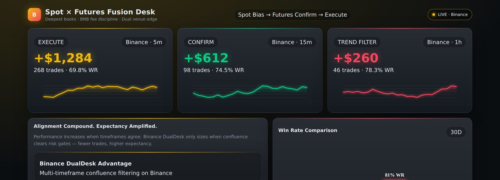
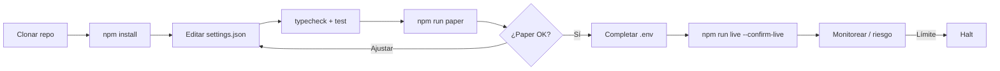
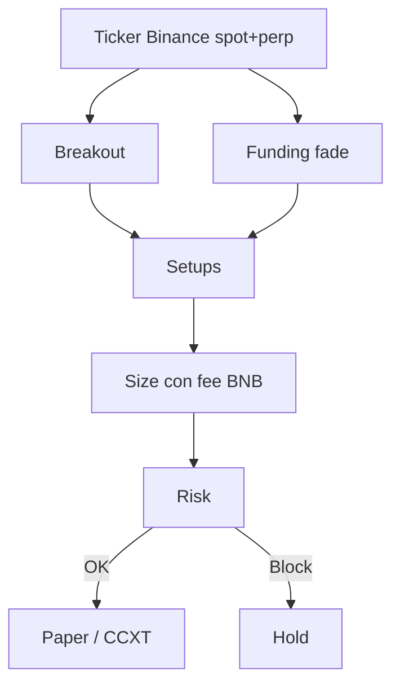

<p align="center">
  
</p>

# Binance Spot & Futures Trading Bot

<p align="center">
  <strong>Deepest books on earth — spot + USDT-M with BNB fee discipline</strong><br/>
  binance · paper + live · risk-gated · MIT
</p>

<p align="center">
  
  
  
  
</p>

<p align="center">
  Idiomas: [English](README.md) · [中文](README.zh.md) · [Deutsch](README.de.md) · **Español**
</p>

> **Palabras clave:** binance trading bot · binance futures bot · binance spot bot · BNB fee discount trading

---

## Instantánea de rendimiento

Analítica demo del dashboard estático incluido (`npm run dashboard`). El banner y los diagramas de estrategia se mantienen.

<p align="center">
  
</p>

<p align="center">
  
</p>

<p align="center">
  
</p>

---

## Flujo del proyecto

Clonar → configurar → paper → credenciales → live. Riesgo siempre activo.



| | |
|--|--|
| `npm run paper` | Primero paper — sin API keys |
| `npm run dashboard` | Abrir dashboard de analítica local (estático) |
| `npm run live` | Requiere `--confirm-live` + credenciales API |

---

## Encaje con la plataforma

| | |
|--|--|
| Venue | binance |
| Mercados | both |
| Edge | Deepest books on earth — spot + USDT-M with BNB fee discipline |
| Ejecución | CCXT live (sandbox) + paper |

---

## Estrategia de trading

Binance concentra la liquidez spot y USDT-M más profunda. Este bot combina **momentum de ruptura** con un **fade de crowding por funding**, y sizea con **conciencia de fees BNB** para que el edge no se coma en comisiones. El libro dual spot/hedge hace visible el delta neto antes del risk gate.

### Cómo funciona
- **Pierna breakout** — Lookback rodante; entra solo si el precio sale del rango con buffer.
- **Pierna funding-fade** — Fondeo extremo positivo/negativo → fade de crowding.
- **Prioridad** — El fade extremo anula el breakout si ambos disparan.
- **Sizing** — % fijo de equity; descuento BNB reduce bps efectivos.
- **Libro dual** — Fills spot con nocional perp casi offset en el libro interno.
- **Risk gate** — Pérdida diaria, drawdown, caps y kill switch.

### Cuándo aparece el edge
**Mejor régimen:** majors líquidos, flujo bilateral, extremos ocasionales de funding.

### Cuándo se rompe
**Falla cuando:** tendencia unidireccional, funding sin reversión, buffer demasiado estrecho (churn de fees).

### Parámetros clave (`settings.json`)
- `breakoutLookback` / `breakoutBufferPct`
- `fundingFadeThreshold`
- `riskPerTradePct` / múltiplos R
- `useBnbDiscount`
- `risk.*`

### Notas de riesgo de la estrategia
- Los perps implican riesgo de liquidación.
- Paper y live comparten la misma ruta de decisión.
- Empieza en sandbox / tamaño minúsculo.


---

## Diagrama de estrategia



---

## Arquitectura

```
src/
  config/     Zod settings + env loader
  strategy/   venue-specific engine
  broker/     paper + CCXT live adapters
  risk/       daily loss / drawdown / caps
  app/        runtime loop
  fees/
  books/
  signals/
```

---

## Inicio rápido

```bash
cd binance-spot-futures-trading-bot
npm install
npm run typecheck
npm test
npm run paper
```

### Live

```bash
cp .env.example .env
# set BINANCE_API_KEY + BINANCE_API_SECRET
# optional BINANCE_PASSWORD / PASSPHRASE
npm run live
```

---

## Configuración

`settings.json` — strategy + risk + paper/live flags.  
`.env` — secrets only (see `.env.example`).

---

## Riesgo y seguridad

- Live refuses without `--confirm-live` and API credentials
- Prefer `live.sandbox: true` until proven
- Disable withdrawals on exchange API keys
- Daily loss / drawdown / notional caps + kill switch

---

## Aviso legal

Software educativo MIT — **no es asesoramiento financiero**. El trading en CEX puede causar pérdida total.

## Licencia

MIT — ver [LICENSE](LICENSE).
