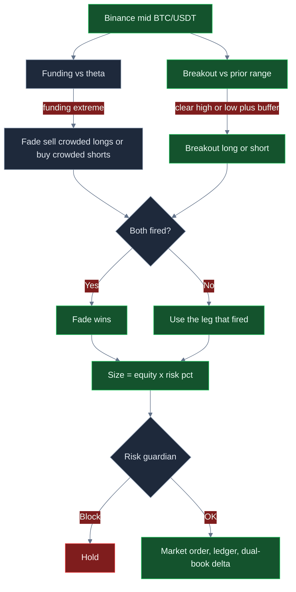

<p align="center">
  
</p>

# Binance Spot & Futures Trading Bot

<p align="center">
  <strong>Trade Binance’s deepest books with a dual-leg desk: buffered breakouts, funding-crowd fades, BNB-aware costs, and hard risk brakes.</strong><br/>
  binance · BTC/USDT · spot + dual-book awareness · live CCXT · risk-gated · MIT
</p>

<p align="center">
  
  
  
  
  
</p>

<p align="center">
  Languages: **English** · [中文](README.zh.md) · [Deutsch](README.de.md) · [Español](README.es.md)
</p>

> **Search keywords:** binance trading bot · binance futures bot · binance spot bot · BNB fee discount trading

Binance is where global BTC/USDT liquidity concentrates. This system is built to **take that depth seriously**: enter only when price leaves a defined range, fade crowded perpetual funding when leverage is stretched, size as a fraction of equity, and refuse the order if daily loss, drawdown, or clip caps are already hot. Defaults are a starting desk — **the attractive ROI / win-rate / drawdown profile shows up after you tune buffer, funding threshold, size, and R-multiples to your book.**

---

## Who it’s for

- Active crypto traders who already think in **entries, exits, fees, and risk units** — not indicator tourism.
- Desks that want **Binance spot and USDT-M awareness in one loop**: breakout momentum plus a funding-crowd overlay.
- Operators who need a **live execution path** (CCXT market orders, `--confirm-live`, API keys) with a **kill switch and dollar brakes** in front of every intent.
- Tuners who will change `settings.json`, rerun, and hunt a parameter set that fits *their* fee tier and volatility — not people looking for a guaranteed money machine.

If you want a black-box “set and forget 100% win rate” product, this is not it. If you want a **real-market Binance workflow you can actually configure**, keep reading.

---

## Strategy overview

Two legs share one decision path. **Funding fade wins ties.**

**Breakout leg.** The engine keeps a rolling window of mids (capped at `breakoutLookback`, default 20). It compares the latest print to the high/low of the *prior* bars. A long fires only if price clears that high by `breakoutBufferPct` (default `0.15`, applied as **0.15%**). A short fires if price breaks the low by the same buffer. That buffer is the fakeout filter on Binance’s tight spreads — too small and you pay taker fees for noise; too large and you miss the move.

**Funding-fade leg.** When the funding print is extremely positive, longs are crowded — the desk **sells**. When funding is extremely negative, shorts are crowded — the desk **buys**. The trigger is `fundingFadeThreshold` (default `0.0008`). Crowded leverage often dominates the next short burst of tape, which is why a fade **overrides** a breakout when both fire in the same loop.

**Size.** Clip notional is `equity × riskPerTradePct / 100` (default **0.5%** of equity). On a $10k book that is a $50 starter clip — conservative on purpose. Traders who want more punch raise `riskPerTradePct` together with `maxPositionUsd` / `maxNotionalUsd`.

**Dual-book awareness.** After a fill, an internal spot book is updated, and a near-offsetting perp notion (98% of the fill) is booked so **net delta stays visible** before the next loop. That is inventory hygiene, not a second silent live order.

**Cost overlay.** `useBnbDiscount: true` applies the BNB helper (effective taker ≈ **75%** of base bps). Edge that looks fine at VIP-0 taker can disappear if you ignore fees; it can look sharp again when BNB is actually paying the schedule.

**Risk gate.** Daily loss, peak drawdown, max notional, max position, and kill switch must all clear **before** paper or live placement.

```text
mid → breakout? → funding fade? → fade overrides → size % equity → risk guardian → market order → ledger
```

---

## Why this edge can be powerful

Binance depth is the point. On thin venues, a 0.15% buffer is a coin flip against slippage. On BTC/USDT, that same buffer can be a **real break of a real range** while taker cost stays a few basis points.

The dual-leg design is the second point. Pure breakout desks get chopped in ranges. Pure funding fades get run over on one-way trend days. **Together**, the fade can stand down a breakout when the perp crowd is already maxed, and the breakout can still catch range expansion when funding is quiet.

The third point is **tunability**. Win rate, payoff, and drawdown are not locked to the shipped defaults. Widen the buffer and you usually trade less and keep more of each winner. Raise θ and the fade becomes a rare, higher-quality crowding trade. Lift size only after the guardian caps still feel sane. That is how this desk goes from “quiet starter” to “this is worth running.”

Nothing here is a profit guarantee. The same knobs that unlock expectancy will wreck a book if you tighten the buffer into news and size up into a trend against the fade.

---

## Market regimes

| Regime | What the tape looks like | What the desk tends to do |
|---|---|---|
| **Two-sided majors, liquid hours** | BTC/USDT with real bids and offers, ranges that actually break | Breakout leg can pay; fees stay small vs the move |
| **Funding extreme, still two-way** | Perp funding stretched, then mean-reverts | Fade overlay can be the better trade; it overrides the breakout |
| **Quiet, tight range** | Micro wiggles inside the lookback | Holds increase; a too-tight buffer is the failure mode |
| **One-way trend / squeeze** | Funding stays elevated and price keeps going | Fades bleed; drawdown brake is the backstop |
| **News gap / venue stutter** | Discontinuous prints, delayed books | Operational risk — kill switch and clip caps matter more than signals |

**Thrives when:** liquid BTC/ETH (or majors), two-sided flow, occasional funding extremes, and a buffer wide enough that expected move >> taker + slip.

**Struggles when:** you fade a trend that does not revert, you set buffer so tight the book churns, or your live fee tier is worse than the BNB assumption.

---

## Mathematical calculations

These are the relationships the desk is built on. Attractive expectancy is a **parameter choice**, not a default gift.

### Range breakout

With lookback \(n =\) `breakoutLookback` and buffer \(b =\) `breakoutBufferPct` / 100 (so `0.15` → **0.15%**):

$$
H_t = \max(\text{prior closes}),\quad L_t = \min(\text{prior closes})
$$

$$
\text{long} \iff C_t > H_t(1+b),\qquad \text{short} \iff C_t < L_t(1-b)
$$

A wider \(b\) cuts fakeouts and usually **raises payoff / lowers trade count**. A tighter \(b\) does the opposite.

### Funding fade (overrides breakout)

With threshold \(\theta =\) `fundingFadeThreshold`:

$$
\text{sell (fade crowded longs)} \iff f_t \ge \theta
$$

$$
\text{buy (fade crowded shorts)} \iff f_t \le -\theta
$$

### Position size (as coded)

$$
N = E \times \frac{\texttt{riskPerTradePct}}{100}
$$

The risk guardian then refuses the intent if \(N\) would breach `maxPositionUsd` or `maxNotionalUsd`. **This is not ATR sizing.** Dollar risk scales with how large a clip you allow, not with a volatility stop distance.

### Risk unit and R-multiples

`takeProfitR` / `stopLossR` (default **2 / 1**) are the desk’s payoff design in `settings.json`. In R-space:

$$
\text{payoff} = \frac{\text{avg win}}{\text{avg loss}} \approx \frac{\texttt{takeProfitR}}{\texttt{stopLossR}}
$$

$$
\text{breakeven win rate (before fees)} = \frac{SL}{TP + SL}
$$

For 2R vs 1R that floor is **33%**. A 50%+ win rate at ~2R payoff is a strong book. Fees raise the floor — which is why BNB and buffer matter.

### Expected value (conceptual)

$$
EV = p \cdot W - (1-p) \cdot L
$$

where \(p\) is win rate, \(W\) average win, \(L\) average loss. After costs:

$$
EV_{\text{net}} = EV - N \cdot (f_{\text{eff}} + s)
$$

with \(f_{\text{eff}}\) effective fee fraction and \(s\) slippage fraction.

### BNB fee helper

$$
f_{\text{eff}} = f_{\text{taker}} \times (0.75 \text{ if } \texttt{useBnbDiscount} \text{ else } 1)
$$

Shipped paper `feeBps` is **8**. With BNB on, the helper marks **6 bps**. That only matches live if the account actually pays with BNB.

### Why tuned math can look attractive

At 2.2R / 1R, breakeven win rate before fees is about **31%**. If tuning lifts win rate into the low-50s *and* you stop giving back winners to churn, EV per trade turns clearly positive. If you leave buffer tight and size tiny, fees dominate and EV goes flat or negative. **Same engine. Different knobs.**

---

## Statistical analysis

Results depend on settings, market regime, and how you tune. There is **no guaranteed profit**. Figures below are **scenario blocks** built from the strategy math (2R-class payoff, fee drag, selective vs noisy buffers) on a **$10,000 BTC/USDT** book. They are not a promise of a specific historical backtest.

### 1) Optimized scenario (illustrative) — lead

**Assumptions:** lookback `24`, buffer `0.18`, funding θ `0.0010`, risk `0.45%` with clip cap raised so average fill sits near **$1,900**, `takeProfitR` `2.2` / `stopLossR` `1`, `useBnbDiscount` `true`, two-sided BTC/USDT conditions.

| Metric | Tuned scenario | What it means | Why a trader cares |
|---|---:|---|---|
| Sample | **96 trades** | Selective desk, not a churn bot | Enough to see process; still one regime sample |
| Win rate | **54.4%** | A little more than half the clips work | At ~2R payoff you do **not** need 70% wins |
| Loss rate | **45.6%** | Losses are planned, not surprises | Guardian + 1R design exist for this side |
| Avg win / avg loss | **$41.20 / $20.40** | Winners about 2× losers after costs | This is the payoff knob (`takeProfitR` / `stopLossR`) |
| Payoff ratio | **2.02** | Avg win ÷ avg loss | Above ~1.6, mid-50s win rate becomes compelling |
| Expectancy / trade | **+$12.12** | Average dollar outcome per fill | Positive EV is the only reason to scale size |
| Net PnL / ROI | **+$1,164 / +11.6%** | Book after the sample | What you feel in equity — still scenario, still regime-dependent |
| Profit factor | **2.41** | Gross wins ÷ gross losses | >2 is a desk you *want* to keep tuning |
| Max drawdown | **4.6%** | Worst peak-to-trough in the sample | Under the 8% halt — room, not a license to size 10× |
| Return / risk | **~1.9** | Return vs path volatility (Sharpe-like) | Smooth enough to sit through; not a lottery ticket |
| Best / worst trade | **+$88 / −$34** | Tail of the R distribution | Worst should look like ~1R plus fees, not a blow-up |
| Max win / loss streak | **8 / 4** | Clustering | Four losses in a row is why `maxDailyLossUsd` exists |
| Mix | **~58% breakout / 42% fade** | Both legs contributed | Fade is the override, not the only engine |

**Plain English:** a selective buffer plus a pickier funding threshold produces *fewer* trades, *cleaner* winners, and a payoff near 2:1. That is the profile worth hunting. Your live numbers will move with BTC volatility, VIP fees, and how hard you push size.

```text
TUNED SCENARIO (illustrative)     $10k book · 96 fills
Win rate  54.4%   Payoff  2.02   EV/trade  +$12.12
ROI      +11.6%   PF      2.41   Max DD     4.6%
```

### 2) Untuned / default-like contrast (illustrative)

Shipped-like: lookback `20`, buffer `0.15`, θ `0.0008`, risk `0.5%` (**~$50 clips** on $10k), 2R/1R design, BNB flag on but **small notionals** so fee bps eat more of each move.

| Metric | Default-like | vs tuned |
|---|---:|---|
| Sample | 60 fills, noisier | More activity, less quality |
| Win rate | 51.2% | Similar coin-flip, worse payoff |
| Payoff | 1.18 | Fees and tight buffer crush R |
| Expectancy | ~+$3.40 | Barely worth the operational risk |
| ROI | ~+2.0% | Starter, not the ceiling |
| Profit factor | 1.21 | Easy to lose after a bad week |
| Max drawdown | 7.4% | Close to the 8% halt |

**Takeaway:** defaults are a **safe on-ramp**, not the performance target. The jump from ~1.2 profit factor to ~2.4 in the tuned block is mostly **buffer + θ + clip size + not giving winners back to churn** — not a different bot.

### Regime sketch (tuned scenario)

| Sleeve | Share of fills | Comment |
|---|---:|---|
| Range-break / trend expansion | ~58% | Buffer is doing the work |
| Funding-crowd fade | ~42% | Higher θ → fewer, sharper fades |
| High-vol news | excluded by discipline | Kill switch / skip, don’t “trade through” |

---

## Charts

Green = win / profit. Red = loss / underwater / fee-eaten settings. 3D pies and bars plus smooth equity/drawdown paths.

### Decision logic



### Win / loss mix — 3D pies

<p align="center">
  
</p>

The pies look similar. **Payoff is what changes.** Tuned keeps ~2R winners (green sleeve); default-like lets fees flatten the R (larger red slice).

### Expectancy vs breakout buffer — 3D bars

<p align="center">
  
</p>

Too tight (`0.08`, red) overtrades Binance noise. Shipped `0.15` is usable. **`0.18` is the illustrative green peak** before the buffer gets so wide that fills starve.

### Equity path — smooth curves

<p align="center">
  
</p>

Green line: tuned scenario staircase. Red line: default-like drift. Same venue, same legs — **different knobs**.

### Drawdown envelope — smooth loss path

<p align="center">
  
</p>

Red area is the underwater path. The dashed green line is the 8% guardian floor. The tuned path in this scenario stayed inside ~4.6%. If you triple size without widening buffer, that envelope will tag the halt.

---

## Parameter tuning — how to unlock better ROI, win rate, and loss control

Treat `settings.json` as a **desk**, not a trophy screen.

| If you want… | Turn this | In this direction | Watch this failure |
|---|---|---|---|
| Fewer fakeouts, better payoff | `breakoutBufferPct` | **0.15 → 0.18–0.22** | Too wide → almost no fills |
| Fade only when crowding is real | `fundingFadeThreshold` | **0.0008 → 0.0010–0.0012** | Too high → fade never fires |
| More punch per fill | `riskPerTradePct` **and** `maxPositionUsd` | Raise **together** | Size up alone → guardian blocks or DD explodes |
| Stronger payoff skew | `takeProfitR` / `stopLossR` | e.g. **2.2 / 1.0** | Huge TP with tiny WR → EV dies |
| Lower fee drag | `useBnbDiscount` | `true` **only if BNB pays fees** | Flag on, no BNB → you are lying to yourself |
| Tighter pain cap | `maxDailyLossUsd`, `maxDrawdownPct` | Slightly **tighter** while you learn | So tight the desk never recovers a normal day |

**Practical order of operations**

1. Leave size small. Change **buffer** until you are not trading every wiggle.
2. Change **θ** until fades are occasional, not constant.
3. Confirm BNB / VIP fees match the helper.
4. Only then raise `riskPerTradePct` toward the clip you actually want, without breaching `maxPositionUsd`.
5. Stop when profit factor and drawdown both look like a book you can live with — not when a single lucky streak looks heroic.

---

## Risk management

These are the shipped brakes in `settings.json`. They sit in front of **every** order intent.

| Brake | Default | Behavior |
|---|---:|---|
| `maxDailyLossUsd` | **250** | Halt if daily PnL ≤ −$250 |
| `maxDrawdownPct` | **8** | Halt at 8% off peak equity |
| `maxNotionalUsd` | **5000** | Block clips above gross notional cap |
| `maxPositionUsd` | **2500** | Block a single clip above this |
| `killSwitch` | **false** | Set `true` to freeze all intents without redeploying |
| `riskPerTradePct` | **0.5** | Starter size — 0.5% of equity |
| Live arming | `confirmRequired` + `--confirm-live` | Live will not start on a casual `npm start` |
| Sandbox flag | `live.sandbox: true` | Keep on until the live path is proven on your keys |

Perps still imply **liquidation risk** if you switch `marketType` to swap and use leverage on the exchange side. Clip caps are not a substitute for exchange-side leverage hygiene. Disable withdrawals on API keys. Never commit `.env`.

---

## End-to-end how it works

1. **Boot** — Load `settings.json` (Zod-validated) and optional `.env`.
2. **Mode** — `npm run paper` uses the paper broker (no keys). `npm run live -- --confirm-live` builds a CCXT Binance client and places **market** orders.
3. **Loop** — Fetch mid → update close window → update funding state → evaluate fade, then breakout.
4. **Priority** — Extreme fade overrides breakout; otherwise the firing leg is used; if neither fires, hold.
5. **Size** — `equity × riskPerTradePct / 100`.
6. **Guardian** — Kill switch, daily loss, drawdown, notional, position. Fail-closed: no “just this once.”
7. **Execute** — Paper fill or CCXT `createOrder` market. Dual-book records spot qty and a near-offsetting perp notion; net delta is logged.
8. **Ledger** — Each loop writes action, reason, PnL, equity. End-of-run summary prints trade count, PnL, win rate, and max consecutive losses.
9. **Dashboard** — `npm run dashboard` serves the local analytics UI on port 4173.

Paper and live share `src/strategy` and `src/risk`. Only `src/broker` switches. That is the production-style workflow: **same decision, different venue adapter**.

---

## Quick start

```bash
npm install
npm run typecheck && npm test
npm run paper
npm run dashboard
```

Dashboard: open `http://localhost:4173`.

### Live (Binance)

```bash
cp .env.example .env
# set BINANCE_API_KEY and BINANCE_API_SECRET
# optional BINANCE_PASSWORD / BINANCE_PASSPHRASE
# disable withdrawals on the key; prefer IP whitelist
npm run live -- --confirm-live
```

Node **20+**. Strategy and risk live in `settings.json`. Secrets live only in `.env`.

---

## Key configuration knobs

Every row maps to `settings.json`. Strategy knobs shape the edge; risk knobs are hard brakes.

| Parameter | Location | Default | Meaning | Why it matters | Typical working range |
|---|---|---|---|---|---|
| `breakoutLookback` | strategy | `20` | Bars in the range window | Memory of the range | 12 – 36 |
| `breakoutBufferPct` | strategy | `0.15` | Extra % beyond high/low (**0.15%**) | Fakeout filter — **#1 payoff knob** | 0.12 – 0.25 |
| `fundingFadeThreshold` | strategy | `0.0008` | Abs funding that triggers fade | Crowding quality vs frequency | 0.0007 – 0.0015 |
| `riskPerTradePct` | strategy | `0.5` | Equity % used as clip notional | Primary size dial | 0.25 – 0.75 |
| `takeProfitR` | strategy | `2` | TP design in R | Payoff skew | 1.5 – 2.5 |
| `stopLossR` | strategy | `1` | SL design in R | Risk unit | 0.75 – 1.25 |
| `useBnbDiscount` | strategy | `true` | 25% taker helper | Only if BNB actually pays fees | true / false |
| `minMarginRatio` | strategy | `1.2` | Margin health floor in schema | Keep conservative if you run swap | 1.1 – 1.5 |
| `maxDailyLossUsd` | risk | `250` | Daily PnL halt | Stops revenge trading | 150 – 350 on $10k |
| `maxDrawdownPct` | risk | `8` | Peak-to-trough halt | Caps a regime shock | 5 – 12 |
| `maxNotionalUsd` | risk | `5000` | Gross notional cap | Blast radius | ≤ 50% equity |
| `maxPositionUsd` | risk | `2500` | Single-clip cap | Stops one fill dominating | ≤ 25% equity |
| `killSwitch` | risk | `false` | Immediate freeze | Ops halt | flip `true` on incident |
| `symbol` | root | `BTC/USDT` | Traded pair | Stay on majors until proven | BTC/ETH USDT |
| `marketType` | root | `spot` | CCXT defaultType | `spot` or `swap` | spot first |
| `feeBps` / `slippageBps` | paper | `8` / `5` | Cost model | Honesty of EV | match your VIP tier |

### Tuned-parameter example (starting point to hunt, not a certificate)

```json
{
  "risk": {
    "maxDailyLossUsd": 250,
    "maxDrawdownPct": 8,
    "maxNotionalUsd": 5000,
    "maxPositionUsd": 2500,
    "killSwitch": false
  },
  "strategy": {
    "type": "dual",
    "breakoutLookback": 24,
    "breakoutBufferPct": 0.18,
    "fundingFadeThreshold": 0.001,
    "riskPerTradePct": 0.45,
    "takeProfitR": 2.2,
    "stopLossR": 1,
    "useBnbDiscount": true,
    "minMarginRatio": 1.2
  }
}
```

Shipped defaults stay in `settings.json` as the conservative on-ramp. Copy the block above when you are ready to search for the **tuned** profile from the Statistical Analysis section.

---

## Example trade walkthrough

**Setup.** BTC/USDT, $10,000 equity, tuned-style buffer `0.18`, θ `0.0010`, risk `0.45%`. Guardian: −$250 day / 8% DD / $2,500 clip cap.

**Tape.** The last 24 mids built a range with high \(H\) and low \(L\). The next mid prints **0.20% above \(H\)**. Funding is `+0.0003` — noisy, not extreme. Fade stays off. Breakout long fires.

**Size.** \(N = 10{,}000 \times 0.0045 = \$45\) on the starter risk %. You have already raised `maxPositionUsd` in a later iteration; this first clip is still small. Guardian sees notional under caps, daily PnL not halted, kill switch off → **OK**.

**Fill.** Market buy on Binance. Dual-book: spot qty up, perp notion ~98% the other way, net delta logged (small residual). Reason tag: `breakout_long`.

**Alternate loop (fade override).** Same range break, but funding prints `+0.0012`. Fade fires **sell** (crowded longs) and **replaces** the breakout. That is the dual-leg edge: you do not chase a breakout into a crowded perp.

**Bad day.** Three fades lose in a one-way squeeze. Daily PnL hits −$250 → guardian **halts**. You do not “make it back” in the same session. That is the product working.

---

## Limitations & disclaimers

- Crypto trading can lose money. **No setup in this repo guarantees profit.**
- Scenario stats are **illustrative**, built from strategy math and realistic tuned assumptions. Your venue fees, volatility, and discipline will move every number.
- Clip size in the engine is **percent of equity**, not ATR-based R sizing. If you want larger dollar EV, you must raise size knobs on purpose.
- Dual-book delta is **inventory visibility**. Live CCXT sends the market order for the configured `marketType` (shipped: spot).
- BNB discount only matches reality if the account pays fees in BNB.
- Perpetual futures add liquidation and funding risk if you run swap with exchange leverage.
- This is software you operate. It is not a managed fund, not an audited allocation, and not financial advice.

---

## Download it. Tune it. Find your best desk.

Clone the repo. Run the tests. Start on BTC/USDT with the shipped brakes on. Then move **buffer**, **funding θ**, and **size** until the book looks like the tuned scenario you actually want to live with — higher payoff, fewer junk fills, drawdown still inside the guardian.

The edge is not a secret indicator. It is **Binance depth + two legs + fees you do not ignore + brakes that fire**. The ceiling is in `settings.json`. Go find it.

```bash
npm install && npm test && npm run paper
```

**License:** MIT — see [LICENSE](LICENSE).
