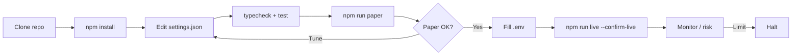
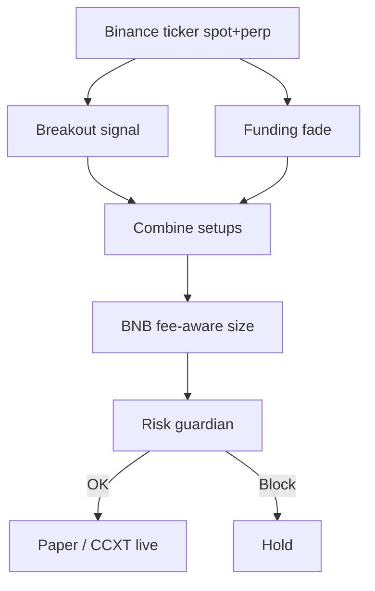

<p align="center">
  
</p>

# Binance Spot & Futures Trading Bot

<p align="center">
  <strong>Deepest books on earth — spot + USDT-M with BNB fee discipline</strong><br/>
  binance · paper + live · risk-gated · MIT
</p>

<p align="center">
  
  
  
  
</p>

<p align="center">
  Languages: **English** · [中文](README.zh.md) · [Deutsch](README.de.md) · [Español](README.es.md)
</p>

> **Search keywords:** binance trading bot · binance futures bot · binance spot bot · BNB fee discount trading

---

## Project workflow

Clone → configure → paper → credentials → live. Risk always on.



| | |
|--|--|
| `npm run paper` | Paper first — no API keys |
| `npm run live` | Requires `--confirm-live` + API credentials |

---

## Platform fit

| | |
|--|--|
| Venue | binance |
| Markets | both |
| Edge | Deepest books on earth — spot + USDT-M with BNB fee discipline |
| Execution | CCXT live (sandbox preferred) + paper simulator |

---

## Trading strategy

Binance concentrates the deepest global spot and USDT-M liquidity. This bot treats that depth as an execution advantage: it combines **range-breakout momentum** with a **funding-crowding fade**, then sizes with **BNB fee awareness** so edge is not eaten by taker costs. Spot and synthetic hedge bookkeeping keep net delta visible before risk gates approve an order.

### How it works
- **Breakout leg** — Track a rolling lookback of closes; enter long/short only when price leaves the prior range by a configurable buffer (reduces fakeouts).
- **Funding-fade leg** — When perpetual funding is extremely positive (crowded longs) or negative (crowded shorts), fade the crowd as a mean-reversion overlay.
- **Signal priority** — Extreme funding fades override breakouts when both fire, because crowded leverage often dominates short-horizon noise.
- **Fee-aware sizing** — Notional is a fixed % of equity (`riskPerTradePct`); effective fee bps shrink when BNB discount mode is enabled.
- **Dual-book awareness** — Spot fills are paired with a near-offsetting perp notion in the internal book so inventory drift is measurable.
- **Risk gate** — Daily loss, drawdown, max notional/position, and kill-switch must all clear before paper or CCXT live execution.

### When the edge appears
**Best regime:** liquid BTC/ETH (or majors) with two-sided flow, occasional funding extremes, and fees that remain small vs expected move. Works as a short-horizon discretionary desk replacement — not as overnight leverage gambling.

### When it breaks down
**Fails when:** one-way trend days invalidate fades, funding stays elevated without mean reversion, or buffer is too tight and churns fees. Gap opens and venue outages are operational risks.

### Key parameters (`settings.json`)
- `strategy.breakoutLookback` / `breakoutBufferPct` — range definition and entry buffer
- `strategy.fundingFadeThreshold` — absolute funding level that triggers a fade
- `strategy.riskPerTradePct`, `takeProfitR`, `stopLossR` — risk unit and R multiples
- `strategy.useBnbDiscount` — apply BNB fee schedule helper
- `risk.*` — hard portfolio brakes

### Strategy-specific risk notes
- Perps imply liquidation risk even when the thesis is “desk-like”.
- Paper and live share the same decision path; only the broker adapter changes.
- Start with sandbox / tiny notional before any real capital.


---

## Strategy diagram



---

## Architecture

```
src/
  config/     Zod settings + env loader
  strategy/   venue-specific engine
  broker/     paper + CCXT live adapters
  risk/       daily loss / drawdown / caps
  app/        runtime loop
  fees/
  books/
  signals/
```

---

## Quickstart

```bash
cd binance-spot-futures-trading-bot
npm install
npm run typecheck
npm test
npm run paper
```

### Live

```bash
cp .env.example .env
# set BINANCE_API_KEY + BINANCE_API_SECRET
# optional BINANCE_PASSWORD / PASSPHRASE
npm run live
```

---

## Configuration

`settings.json` — strategy + risk + paper/live flags.  
`.env` — secrets only (see `.env.example`).

---

## Risk & safety

- Live refuses without `--confirm-live` and API credentials
- Prefer `live.sandbox: true` until proven
- Disable withdrawals on exchange API keys
- Daily loss / drawdown / notional caps + kill switch

---

## Disclaimer

Educational MIT software — **not financial advice**. CEX trading can cause total loss of capital.

## License

MIT — see [LICENSE](LICENSE).
