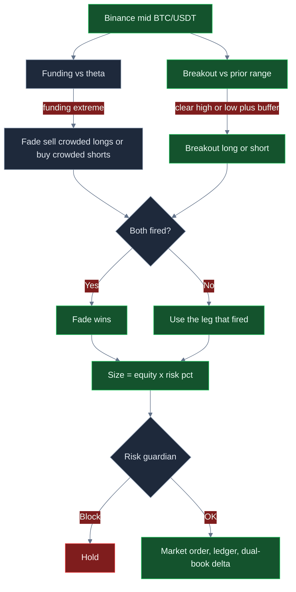
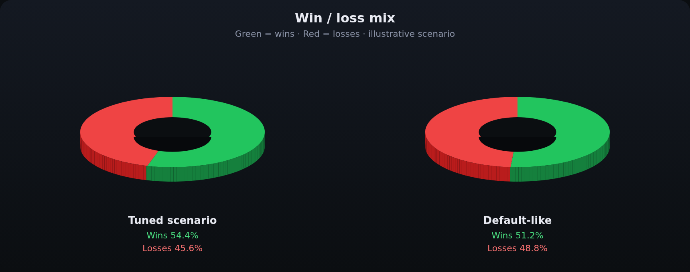
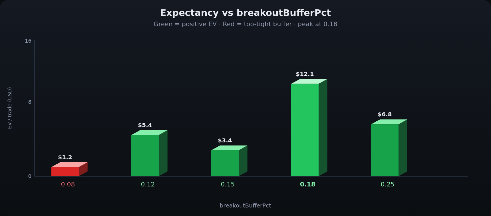
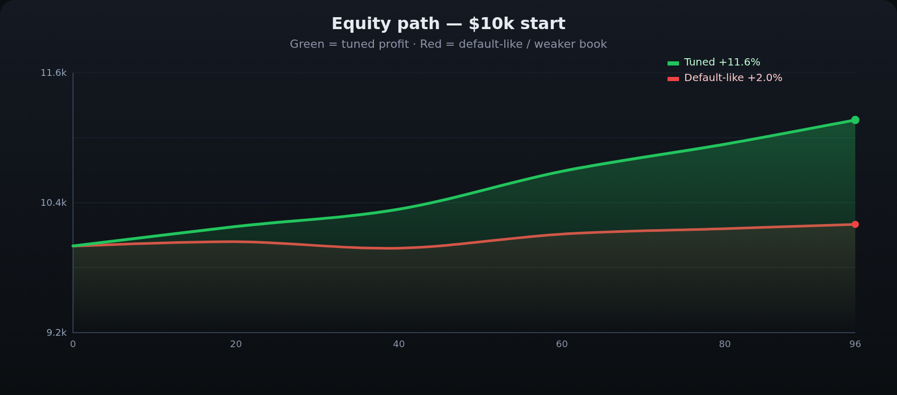
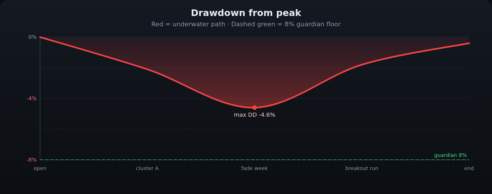

<p align="center">
  
</p>

# 币安现货与合约交易机器人

<p align="center">
  <strong>在币安最深流动性上运行双腿交易台：带缓冲的突破、拥挤资金费率反向、BNB 成本意识，以及硬风控刹车。</strong><br/>
  binance · BTC/USDT · 现货 + 双账本可见性 · 实盘 CCXT · 风控门控 · MIT
</p>

<p align="center">
  
  
  
  
  
</p>

<p align="center">
  语言: [English](README.md) · **中文** · [Deutsch](README.de.md) · [Español](README.es.md)
</p>

> **搜索关键词:** binance trading bot · binance futures bot · binance spot bot · BNB fee discount trading

全球 BTC/USDT 流动性集中在币安。本系统按这个深度来设计：**价格离开既定区间才进场**，永续资金费率拥挤时反向，按权益比例下单，日亏损、回撤或仓位上限已热时直接拒单。默认参数只是起点——**有吸引力的 ROI / 胜率 / 回撤，来自你把缓冲、资金费率阈值、仓位和 R 倍数调到自己的账本上。**

完整英文产品文案见 **[English README](README.md)**。图表与调参表已包含在本页。

---

## 适合谁

- 已经按 **进场、出场、手续费、风险单位** 思考的活跃交易者。
- 希望在同一循环里同时看到 **币安现货 + U 本位拥挤度**：突破动量 + 资金费率反向。
- 需要 **实盘执行路径**（CCXT 市价单、`--confirm-live`、API 密钥）且每笔意图前都有 **熔断与美元刹车** 的操作者。
- 会改 `settings.json`、重跑、寻找匹配自己费率档与波动的参数组的人——不是来找“保证赚钱机器”的人。

---

## 策略怎么走

两条腿共用一条决策路径。**资金费率反向优先。**

**突破腿。** 滚动保存中间价（上限 `breakoutLookback`，默认 20）。最新价相对**前序**高低点：高出 `breakoutBufferPct`（默认 `0.15`，即 **0.15%**）做多；低出同样缓冲做空。缓冲是假突破过滤器。

**资金费率反向腿。** 资金费率极正 → 多头拥挤 → **卖**；极负 → 空头拥挤 → **买**。阈值 `fundingFadeThreshold`（默认 `0.0008`）。同一循环两边都触发时，**反向覆盖突破**。

**仓位。** 名义 = `权益 × riskPerTradePct / 100`（默认权益的 **0.5%**）。$10k 账本上约 $50 起步单。要加大火力，请同时提高 `riskPerTradePct` 与 `maxPositionUsd` / `maxNotionalUsd`。

**双账本。** 成交后更新现货数量，并记入约 98% 反向的合约名义，让 **净 Delta 可见**。这是库存卫生，不是第二笔静默实盘单。

**BNB。** `useBnbDiscount: true` 时，助手把有效 taker 记为基础 bps 的约 **75%**。账户必须真的用 BNB 付费，数字才对得上。

**风控门。** 日亏损、峰值回撤、名义上限、单笔上限、熔断，全部通过后才下单。

---

## 为什么这套边可能强

币安深度是前提。浅市场里 0.15% 缓冲会被滑点吃掉；BTC/USDT 上它可以是一次真实的区间突破，而 taker 成本只有几个 bps。

纯突破在震荡里被削；纯资金费率反向在单边趋势里被轧。**合在一起**：拥挤时反向可以拦住追突破；资金费率平静时突破仍能吃到扩张。

可调性是第三点。胜率、盈亏比、回撤没有锁死在出厂默认上。加宽缓冲通常少做、多留盈利；提高 θ 让反向变成更稀、更干净的拥挤单。先把风控上限想清楚，再加仓。

同一组旋钮也能毁掉账本：缓冲拧进新闻、对着趋势加反向仓。没有保证收益。

---

## 市场环境

| 环境 | 盘面 | 交易台倾向 |
|---|---|---|
| **双边主流、活跃时段** | BTC/USDT 真实买卖、区间会破 | 突破腿可能兑现；费用相对波动小 |
| **资金费率极端、仍双边** | 费率拉伸后回归 | 反向可能是更好的单，并覆盖突破 |
| **安静窄幅** | 回看窗口内微抖 | 多空仓；缓冲过紧是失败模式 |
| **单边趋势 / 轧空** | 费率维持高位且价格继续走 | 反向出血；回撤刹车是后盾 |
| **新闻跳空 / 交易所卡顿** | 不连续报价 | 操作风险——熔断和仓位上限比信号更重要 |

---

## 数学（与代码一致的部分）

**突破**（\(b =\) `breakoutBufferPct` / 100，故 `0.15` → **0.15%**）：

$$
\text{long} \iff C_t > H_t(1+b),\qquad \text{short} \iff C_t < L_t(1-b)
$$

**资金费率反向**（覆盖突破）：

$$
\text{卖} \iff f_t \ge \theta,\qquad \text{买} \iff f_t \le -\theta
$$

**仓位（引擎实际用法）：**

$$
N = E \times \frac{\texttt{riskPerTradePct}}{100}
$$

**2R / 1R 设计的盈亏平衡胜率（费前）** = \(1/(2+1)\) = **33%**。费用会抬高这条线，所以 BNB 和缓冲重要。

$$
EV = p \cdot W - (1-p) \cdot L - N \cdot (f_{\text{eff}} + s)
$$

$$
f_{\text{eff}} = f_{\text{taker}} \times (0.75 \text{ if BNB else } 1)
$$

出厂 `feeBps` = **8**；BNB 开启时助手记 **6 bps**。

---

## 统计分析

数字随参数、行情和调参水平变化。**不保证盈利。** 以下是基于策略数学的 **情景块**（$10,000 BTC/USDT 账本），不是某次历史回测承诺。

### 1）优化情景（示意）— 优先展示

假设：lookback `24`，缓冲 `0.18`，θ `0.0010`，risk `0.45%` 且均笔约 **$1,900**，TP/SL `2.2` / `1`，BNB 开，双边 BTC/USDT。

| 指标 | 优化情景 | 含义 |
|---|---:|---|
| 样本 | **96 笔** | 选择性交易台，不是刷单 |
| 胜率 | **54.4%** | 约 2R 盈亏比下不需要 70% 胜率 |
| 亏损率 | **45.6%** | 亏损是计划内的 |
| 平均盈 / 亏 | **$41.20 / $20.40** | 盈利约 2 倍亏损 |
| 盈亏比 | **2.02** | 中 50% 胜率开始有吸引力 |
| 期望 / 笔 | **+$12.12** | 正期望才值得加仓 |
| 净盈亏 / ROI | **+$1,164 / +11.6%** | 仍是情景、仍依赖环境 |
| 盈利因子 | **2.41** | >2 值得继续调 |
| 最大回撤 | **4.6%** | 低于 8% 熔断 |
| 收益 / 风险 | **~1.9** | 路径相对平滑 |
| 最好 / 最差 | **+$88 / −$34** | 最差应接近 1R+费用 |
| 连胜 / 连亏 | **8 / 4** | 所以才有 `maxDailyLossUsd` |
| 结构 | **约 58% 突破 / 42% 反向** | 反向是覆盖腿，不是唯一引擎 |

### 2）未调 / 偏默认对照（示意）

| 指标 | 偏默认 | 对比 |
|---|---:|---|
| 样本 | 60 笔、更噪 | 更勤、更差 |
| 胜率 | 51.2% | 接近抛硬币、盈亏比更差 |
| 盈亏比 | 1.18 | 费用和过紧缓冲压扁 R |
| 期望 | 约 +$3.40 | 几乎不够覆盖操作风险 |
| ROI | 约 +2.0% | 起点，不是天花板 |
| 盈利因子 | 1.21 | 坏一周就容易翻负 |
| 最大回撤 | 7.4% | 靠近 8% 熔断 |

**结论：** 默认是安全上车，不是业绩目标。盈利因子从 ~1.2 到 ~2.4，主要来自 **缓冲 + θ + 单笔规模 + 少把盈利交回刷单**。

---

## 图表

**绿色 = 盈利 / 胜。红色 = 亏损 / 更弱路径。** 决策流用 GitHub Mermaid。业绩图是 3D 风格 PNG，可在 GitHub 上正常显示。

### 决策逻辑



### 胜负结构

<p align="center">
  
</p>

两张饼看起来接近。**真正拉开的是盈亏比。** 优化情景保住约 2R 赢家（绿）；偏默认被费用压扁 R（红瓣更大）。

### 期望 vs 突破缓冲

<p align="center">
  
</p>

过紧（`0.08`，红）会在币安噪声上刷单。出厂 `0.15` 可用。**`0.18` 是示意中的绿色峰值**，再宽就会缺单。

### 权益曲线

<p align="center">
  
</p>

绿线：优化情景。红线：偏默认漂移。同一交易所、同一双腿——**不同旋钮**。

### 回撤

<p align="center">
  
</p>

红区是水下路径。绿色虚线是 8% 熔断地板。该示意路径最大回撤约 4.6%。缓冲不加大却把仓位加三倍，包络会撞上熔断。

---

## 参数调优 — 如何打开更好的 ROI、胜率和亏损控制

把 `settings.json` 当成**交易台**，不是奖杯屏。

| 如果你想… | 拧这个 | 往这个方向 | 失败模式 |
|---|---|---|---|
| 更少假突破、更好盈亏比 | `breakoutBufferPct` | **0.15 → 0.18–0.22** | 太宽 → 几乎没单 |
| 只在真正拥挤时反向 | `fundingFadeThreshold` | **0.0008 → 0.0010–0.0012** | 太高 → 反向从不触发 |
| 每笔更有火力 | `riskPerTradePct` **和** `maxPositionUsd` | **一起**提高 | 只加仓 → 风控拒单或回撤爆炸 |
| 更强盈亏比倾斜 | `takeProfitR` / `stopLossR` | 例如 **2.2 / 1.0** | TP 极大但胜率极低 → EV 死 |
| 更低费用拖累 | `useBnbDiscount` | 仅当 BNB **真的付费** 时 `true` | 开了旗却没 BNB → 自己骗自己 |
| 更紧的痛感上限 | `maxDailyLossUsd`, `maxDrawdownPct` | 学习阶段略**收紧** | 紧到正常一天都做不完 |

**实操顺序：** 先小仓改缓冲 → 再改 θ → 核对 BNB/VIP 费用 → 最后加 `riskPerTradePct`，不要超过 `maxPositionUsd`。

---

## 风控（出厂 `settings.json`）

| 刹车 | 默认 | 行为 |
|---|---:|---|
| `maxDailyLossUsd` | **250** | 日盈亏 ≤ −$250 停 |
| `maxDrawdownPct` | **8** | 离峰值 8% 停 |
| `maxNotionalUsd` | **5000** | 超总名义拒单 |
| `maxPositionUsd` | **2500** | 超单笔拒单 |
| `killSwitch` | **false** | 置 `true` 立即冻结 |
| `riskPerTradePct` | **0.5** | 起步仓位 |
| 实盘武装 | `--confirm-live` | 不会随手 `npm start` 就下真单 |
| 沙盒 | `live.sandbox: true` | 密钥跑通前保持开启 |

API 密钥请关闭提现。不要提交 `.env`。若把 `marketType` 改为 swap 并使用杠杆，仍有爆仓风险。

---

## 快速开始

```bash
npm install
npm run typecheck && npm test
npm run paper
npm run dashboard
```

```bash
cp .env.example .env
# 填写 BINANCE_API_KEY / BINANCE_API_SECRET
npm run live -- --confirm-live
```

Node **20+**。策略与风控在 `settings.json`，密钥只放 `.env`。

优化情景的调参示例：

```json
{
  "strategy": {
    "type": "dual",
    "breakoutLookback": 24,
    "breakoutBufferPct": 0.18,
    "fundingFadeThreshold": 0.001,
    "riskPerTradePct": 0.45,
    "takeProfitR": 2.2,
    "stopLossR": 1,
    "useBnbDiscount": true,
    "minMarginRatio": 1.2
  }
}
```

---

## 限制与声明

加密交易可能亏损。**本仓库任何配置都不保证盈利。** 统计是示意情景。引擎仓位是 **权益百分比**，不是 ATR 止损距离。双账本 Delta 是库存可见性；实盘 CCXT 按配置的 `marketType`（出厂：spot）发市价单。BNB 折扣仅在账户真用 BNB 付费时成立。这是你自己运行的软件，不是代客理财，也不是投资建议。

---

## 下载、调参、找到你的最优桌面

克隆、跑测试、在 BTC/USDT 上带着出厂刹车起步。然后动 **缓冲、资金费率 θ、仓位**，直到账本接近你愿意长期承受的优化情景——更高盈亏比、更少垃圾单、回撤仍在风控内。

```bash
npm install && npm test && npm run paper
```

**许可证：** MIT — 见 [LICENSE](LICENSE)。
