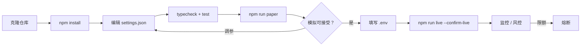
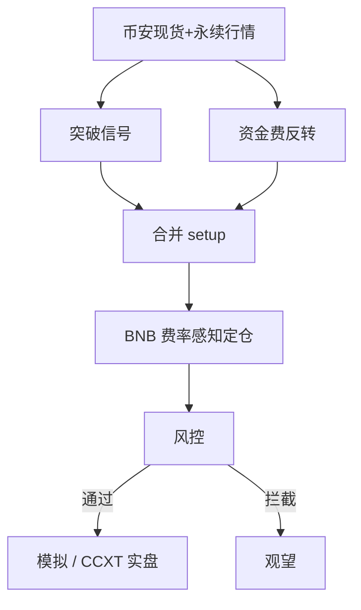

<p align="center">
  
</p>

# 币安现货与合约交易机器人

<p align="center">
  <strong>全球最深流动性 — 现货 + U 本位，BNB 费率纪律</strong><br/>
  binance · paper + live · risk-gated · MIT
</p>

<p align="center">
  
  
  
  
</p>

<p align="center">
  语言: [English](README.md) · **中文** · [Deutsch](README.de.md) · [Español](README.es.md)
</p>

> **搜索关键词:** binance trading bot · binance futures bot · binance spot bot · BNB fee discount trading

---

## 表现快照

内置静态仪表盘演示数据（`npm run dashboard`）。横幅与策略流程图保持不变。

<p align="center">
  
</p>

<p align="center">
  
</p>

<p align="center">
  
</p>

---

## 项目工作流

克隆 → 配置 → 模拟 → 凭证 → 实盘。风控始终开启。



| | |
|--|--|
| `npm run paper` | 先跑模拟盘 — 无需 API Key |
| `npm run dashboard` | 打开本地分析仪表盘（静态） |
| `npm run live` | 需要 `--confirm-live` 与 API 凭证 |

---

## 平台契合点

| | |
|--|--|
| 交易所 | binance |
| 市场 | both |
| 优势定位 | 全球最深流动性 — 现货 + U 本位，BNB 费率纪律 |
| 执行 | CCXT 实盘（优先 sandbox）+ 模拟盘 |

---

## 交易策略

币安拥有全球最深的现货与 U 本位永续流动性。本机器人把深度当作执行优势：结合**区间突破动量**与**资金费拥挤反转**，并以 **BNB 费率感知**定仓，避免手续费吞噬优势。内部现货/对冲账本跟踪净德尔塔，通过风控后才下单。

### 如何运作
- **突破腿** — 滚动回看收盘价；仅当价格带缓冲突破前高/前低时开仓，降低假突破。
- **资金费反转腿** — 资金费极端为正（多头拥挤）或为负（空头拥挤）时反向交易。
- **信号优先级** — 两者同时触发时，极端资金费反转优先于突破。
- **费率感知定仓** — 名义本金为权益固定比例；启用 BNB 折扣时降低有效费率。
- **双账本** — 现货成交在内部与近乎对冲的永续名义配对，便于观察漂移。
- **风控闸门** — 日亏损、回撤、名义/仓位上限与熔断全部通过后才执行。

### 优势出现的条件
**适合行情：** 流动性好的主流币、双边成交活跃、偶发资金费极端，且手续费相对预期波动较小。

### 何时失效
**失效场景：** 单边趋势日反转失效、资金费长期不回归、缓冲过紧导致频繁摩擦成本；跳空与交易所故障亦需防范。

### 关键参数（`settings.json`）
- `breakoutLookback` / `breakoutBufferPct` — 区间与缓冲
- `fundingFadeThreshold` — 资金费反转阈值
- `riskPerTradePct` 与 R 倍数 — 单笔风险
- `useBnbDiscount` — BNB 费率辅助
- `risk.*` — 组合硬刹车

### 策略特有风险提示
- 永续仍有爆仓风险。
- 模拟与实盘共用决策路径。
- 先 sandbox / 极小仓位。


---

## 策略流程图



---

## 架构

```
src/
  config/     Zod settings + env loader
  strategy/   venue-specific engine
  broker/     paper + CCXT live adapters
  risk/       daily loss / drawdown / caps
  app/        runtime loop
  fees/
  books/
  signals/
```

---

## 快速开始

```bash
cd binance-spot-futures-trading-bot
npm install
npm run typecheck
npm test
npm run paper
```

### 实盘

```bash
cp .env.example .env
# set BINANCE_API_KEY + BINANCE_API_SECRET
# optional BINANCE_PASSWORD / PASSPHRASE
npm run live
```

---

## 配置

`settings.json` — strategy + risk + paper/live flags.  
`.env` — secrets only (see `.env.example`).

---

## 风险与安全

- Live refuses without `--confirm-live` and API credentials
- Prefer `live.sandbox: true` until proven
- Disable withdrawals on exchange API keys
- Daily loss / drawdown / notional caps + kill switch

---

## 免责声明

MIT 教育软件 — **不构成投资建议**。中心化交易所交易可能导致本金全部损失。

## 许可证

MIT — 见 [LICENSE](LICENSE)。
